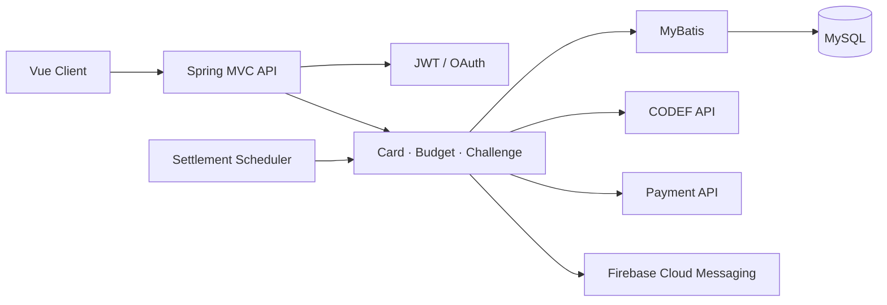
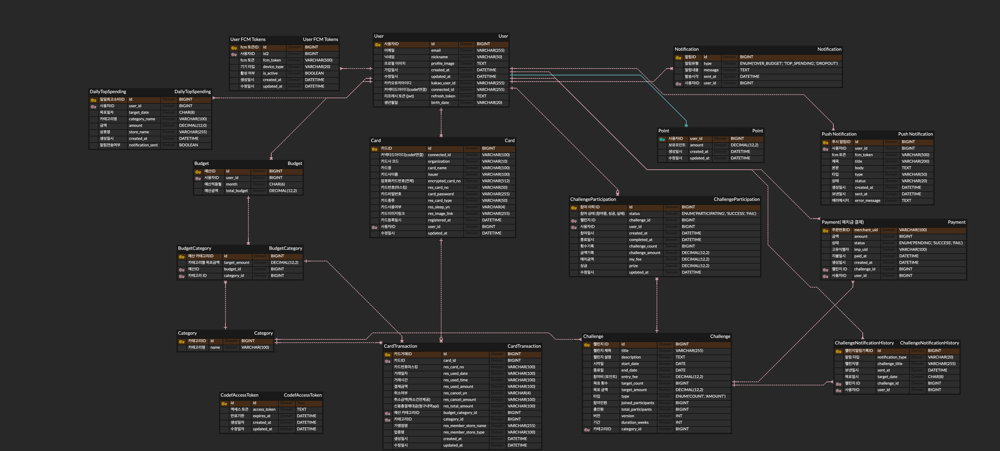

<p align="center">
  
</p>

# SAVIT Server

> 사회초년생을 위한 첫 신용카드 비서<br>
> 카드 사용 내역을 분석하고 예산 관리와 절약 챌린지를 연결한 금융 생활 관리 서비스입니다.

[](https://openjdk.org/)
[](https://spring.io/)
[](https://www.mysql.com/)
[](https://mybatis.org/mybatis-3/)

이 저장소는 **KB국민은행 IT 부트캠프 최종 프로젝트** [`IntelliJeju/savit-server`](https://github.com/IntelliJeju/savit-server)를 기반으로, 백엔드 개발자 **김희주**의 담당 기능과 기술적 의사결정을 포트폴리오 목적으로 정리한 Fork입니다. 팀 원본의 이력은 그대로 보존하며, 이후의 개인 학습과 검증은 별도 개선 사항으로 명확히 구분합니다.

- [팀 원본 서버 저장소](https://github.com/IntelliJeju/savit-server)
- [클라이언트 저장소](https://github.com/IntelliJeju/savit-client)
- [서비스 데모](https://savit-client.vercel.app/)

## 프로젝트 요약

SAVIT은 여러 카드의 사용 내역을 한곳에서 확인하고, 소비 패턴에 맞춘 예산과 절약 챌린지를 관리할 수 있도록 만든 서비스입니다.

### 💳 카드 통합 관리

- CODEF API 기반 카드 등록 및 사용 내역 조회
- 여러 카드의 거래 내역을 카테고리별로 분류
- 월별·기간별 소비 현황 제공

### 💰 예산 관리

- 월별·카테고리별 예산 설정
- 예산 대비 실제 지출 모니터링
- 소비 패턴과 또래 평균 비교

### 🏆 절약 챌린지

- 예치금 기반 절약 목표 참여
- 참여 현황과 달성률 추적
- 종료 후 결과 판정, 포인트 및 정산 처리

### 🔔 인증과 알림

- JWT 기반 인증과 카카오 OAuth 로그인
- Firebase Cloud Messaging 기반 알림
- 카드 사용 및 챌린지 상태 변화 안내

## 담당 역할

**백엔드 팀장**으로서 기능 개발과 함께 일정·이슈 관리, API 설계 조율, 팀원의 개발 이슈 해결을 담당했습니다.

| 영역 | 담당 내용 |
| --- | --- |
| 리딩 | 백엔드 일정·이슈 관리, API 설계 조율, 코드 통합 및 배포 점검 |
| 결제 | 결제 API 구현, 금액·사용자 검증, 중복 요청 방어 |
| 챌린지 | 참여 상태 자동화, 결과 조회, 포인트 및 정산 흐름 구현 |
| 동시성 | 정원 경쟁 시 CAS 재시도와 비관적 락을 조합한 참여 처리 |
| 카드 | 카드 등록·거래 내역 저장, 중복 카드 등록 방지 |
| 인증·배포 | JWT 인증 연동, Linux 배포 환경 대응, CI/CD 개선 |

담당 변경 내역은 [GitHub 커밋 기록](https://github.com/IntelliJeju/savit-server/commits/dev/?author=hj1016)에서 확인할 수 있습니다.

## 핵심 기술 과제

### 1. 중복 결제 요청을 한 번만 반영

결제 완료 요청은 네트워크 재시도나 사용자의 중복 입력으로 여러 번 도착할 수 있습니다. `merchantUid`로 기존 결제를 확인하고 결제 행을 잠근 뒤, 처리 직전에 상태를 다시 검증하도록 구성했습니다.

```text
결제 검증 요청
  └─ merchantUid로 결제 조회 + FOR UPDATE
       ├─ 이미 완료된 결제 → 기존 결과 반환
       └─ 대기 중 결제 → PG 금액 검증 → 상태 변경
```

### 2. 동시에 몰리는 챌린지 참여 제어

여러 사용자가 마지막 자리에 동시에 참여하더라도 정원을 초과하지 않도록 낙관적 락 기반 CAS를 우선 사용하고, 충돌이 반복되면 비관적 락으로 전환했습니다. 참여 데이터에는 중복 방지 조건을 두고 처리 직전 상태를 다시 확인했습니다.

### 3. 결제와 정산의 상태 일관성

결제 성공, 챌린지 참여, 포인트 적립처럼 함께 변경되어야 하는 내부 데이터는 하나의 트랜잭션 경계에서 처리했습니다. 정산 작업은 대상 데이터를 잠근 뒤 현재 상태를 재확인해 두 스케줄러가 같은 참여 건을 중복 처리하지 않도록 설계했습니다.

## 시스템 구성



## 데이터 모델



## 기술 스택

- Java 17, Spring Framework 5.3, Spring Security
- MyBatis, MySQL, HikariCP
- JWT, Firebase Admin SDK
- CODEF API, 결제 API, Kakao OAuth
- Gradle, WAR, GitHub Actions

## 최종 프로젝트 이후 개인 보완

팀 원본에는 영향을 주지 않고 개인 Fork에서 결제 실패 시나리오를 추가로 보완했습니다.

- 결제 금액 범위와 원 단위 정수 검증 강화
- 챌린지 참여 실패 시 자동 환불과 `REFUND_FAILED` 상태 관리
- 실패 환불을 건별 트랜잭션으로 재처리하는 스케줄러

구현은 [`PaymentService`](src/main/java/com/savit/challenge/service/PaymentService.java)와 [`RefundRetryScheduler`](src/main/java/com/savit/scheduler/job/RefundRetryScheduler.java)에서 확인할 수 있습니다.

### CODEF 토큰 캐시 성능 검증

로컬에서는 CODEF 액세스 토큰 DB 캐싱의 효과를 비교하기 위해 k6 시나리오와 MySQL 기반 재현 환경도 구성했습니다.

CODEF 외부망에 부하를 주지 않기 위해 토큰 발급 지연을 400ms로 모사한 stub 환경에서 측정했습니다. VU 20, 80초 조건에서 토큰 획득 p95가 **816ms에서 5ms**로 감소했습니다. 이 값은 실제 CODEF 운영 성능이 아니라 캐싱 전후의 구조적 차이를 확인하기 위한 로컬 실험 결과입니다.

## 저장소 운영 방침

- 팀의 최종 프로젝트 결과물과 개인 후속 개선을 커밋과 문서에서 구분합니다.
- 비밀키와 운영 자격증명은 저장소에 포함하지 않습니다.
- 외부 연동이 필요한 테스트는 stub 또는 test profile에서만 실행합니다.

## 회고

기능을 빠르게 완성하는 것만큼 중복 요청, 동시 실행, 외부 결제 성공 이후의 실패처럼 정상 경로 밖의 상태를 설계하는 일이 중요하다는 것을 배웠습니다. 이후에는 기능 구현 전에 상태 전이와 실패 시나리오를 먼저 정리하고, 재현 가능한 테스트로 기술 선택을 검증하는 방식을 적용하고 있습니다.
